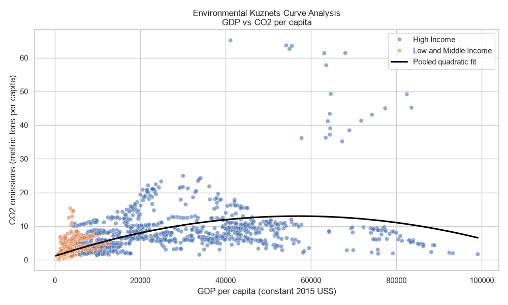

# Generated Results Report

<!-- run-id: c29ac595e8f16acf -->

Run `c29ac595e8f16acf` uses locked source snapshot `snapshot-f8168d697265`.

## Resolved selection rule

Retain eligible countries with at least 15 complete years from 1990–2020 across `GDP_per_capita`, `CO2_per_capita`, `Education_Tertiary`, `Rule_of_Law`.

## Sample composition

| sample_id         | n_observations   | n_countries   | n_observed_years   | first_year   | last_year   | mean_observations_per_country   | min_observations_per_country   | max_observations_per_country   |
|:------------------|:-----------------|:--------------|:-------------------|:-------------|:------------|:--------------------------------|:-------------------------------|:-------------------------------|
| full_sample       | 2009             | 104           | 22                 | 1996         | 2020        | 19.3173                         | 15                             | 22                             |
| high_income       | 784              | 41            | 22                 | 1996         | 2020        | 19.122                          | 15                             | 22                             |
| low_middle_income | 1225             | 63            | 22                 | 1996         | 2020        | 19.4444                         | 15                             | 22                             |

## Preferred-model coefficients

| sample_id         | term               | estimate    | std_error   | p_value    | ci_lower    | ci_upper    |
|:------------------|:-------------------|:------------|:------------|:-----------|:------------|:------------|
| full_sample       | const              | 3.09342     | 1.10032     | 0.00498402 | 0.935445    | 5.25139     |
| full_sample       | GDP_k              | 0.145409    | 0.105629    | 0.168801   | -0.0617539  | 0.352571    |
| full_sample       | GDP_sq             | -0.00194837 | 0.00113826  | 0.0871142  | -0.00418075 | 0.000284009 |
| full_sample       | Rule_of_Law        | -0.0131392  | 0.0425371   | 0.757441   | -0.096564   | 0.0702856   |
| full_sample       | Education_Tertiary | 0.0230476   | 0.0138641   | 0.0966008  | -0.00414307 | 0.0502383   |
| high_income       | const              | 3.52476     | 3.53108     | 0.318514   | -3.40771    | 10.4572     |
| high_income       | GDP_k              | 0.220911    | 0.208296    | 0.289247   | -0.188032   | 0.629853    |
| high_income       | GDP_sq             | -0.00218877 | 0.00173324  | 0.207064   | -0.0055916  | 0.00121405  |
| high_income       | Rule_of_Law        | -0.0295064  | 0.1316      | 0.822656   | -0.287873   | 0.22886     |
| high_income       | Education_Tertiary | 0.0389359   | 0.0275043   | 0.157318   | -0.0150626  | 0.0929344   |
| low_middle_income | const              | -1.04779    | 1.419       | 0.460426   | -3.83194    | 1.73637     |
| low_middle_income | GDP_k              | 1.08444     | 0.494375    | 0.0284691  | 0.114451    | 2.05443     |
| low_middle_income | GDP_sq             | -0.047102   | 0.0292054   | 0.107069   | -0.104405   | 0.0102006   |
| low_middle_income | Rule_of_Law        | -0.0324972  | 0.0264589   | 0.21962    | -0.084411   | 0.0194165   |
| low_middle_income | Education_Tertiary | 0.00890269  | 0.00734733  | 0.225882   | -0.00551314 | 0.0233185   |

## Turning point

The coefficient ratio implies $11,512, but the quadratic confidence interval includes zero. The finite turning point is therefore not statistically identified; the delta interval is recorded only as a mechanical diagnostic.

| sample_id         | model_id       | confidence_level   | estimate_usd   | delta_standard_error_usd   | delta_ci_lower_usd   | delta_ci_upper_usd   | linear_estimate   | quadratic_estimate   | quadratic_ci_lower   | quadratic_ci_upper   | quadratic_ci_contains_zero   | inverted_u_signs   | observed_gdp_min_usd   | observed_gdp_max_usd   | within_observed_gdp_support   | identification_status               |
|:------------------|:---------------|:-------------------|:---------------|:---------------------------|:---------------------|:---------------------|:------------------|:---------------------|:---------------------|:---------------------|:-----------------------------|:-------------------|:-----------------------|:-----------------------|:------------------------------|:------------------------------------|
| low_middle_income | entity_year_fe | 0.95               | 11511.6        | 2127.07                    | 7342.65              | 15680.6              | 1.08444           | -0.047102            | -0.104405            | 0.0102006            | True                         | True               | 227.198                | 14040.6                | True                          | finite_turning_point_not_identified |

## Missingness in the retained-country panel

| scope                  | variable           | expected_rows   | observed_rows   | missing_count   | missing_percentage   | uniquely_excluded_rows   |
|:-----------------------|:-------------------|:----------------|:----------------|:----------------|:---------------------|:-------------------------|
| retained_country_panel | GDP_per_capita     | 3224            | 3208            | 16              | 0.496278             | 0                        |
| retained_country_panel | CO2_per_capita     | 3224            | 3223            | 1               | 0.0310174            | 0                        |
| retained_country_panel | Education_Tertiary | 3224            | 2462            | 762             | 23.6352              | 278                      |
| retained_country_panel | Rule_of_Law        | 3224            | 2287            | 937             | 29.0633              | 453                      |

## Figure

